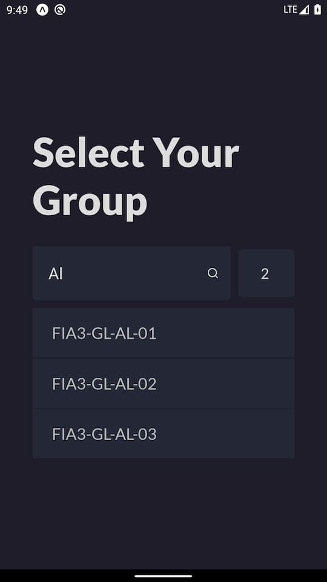
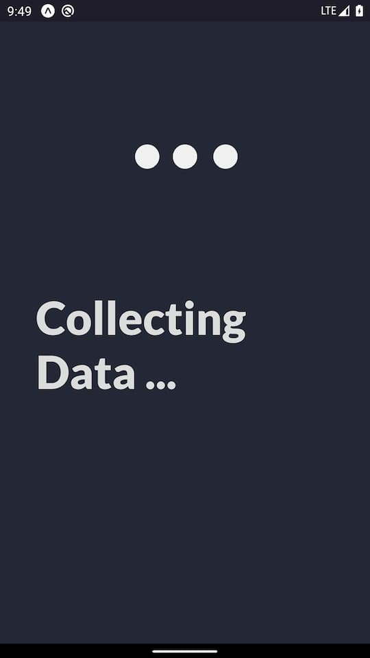
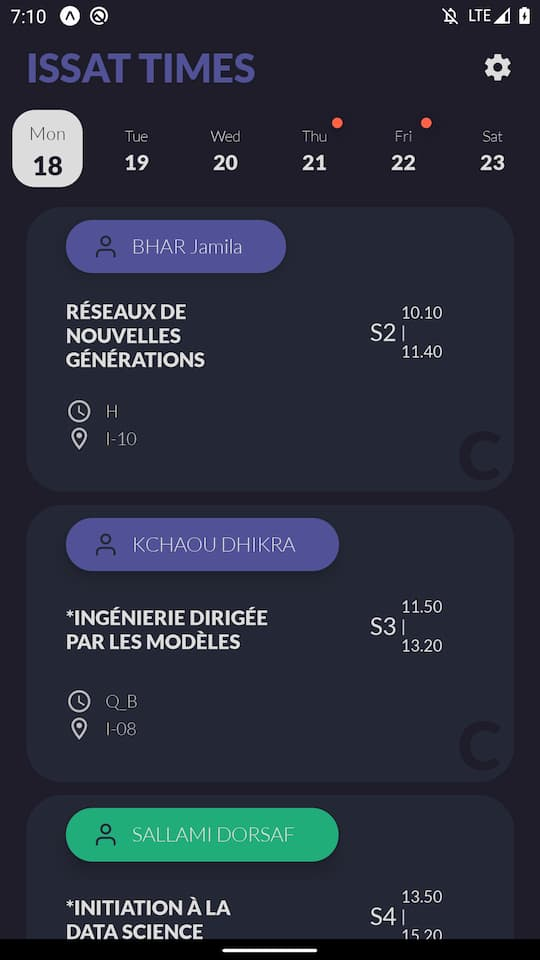
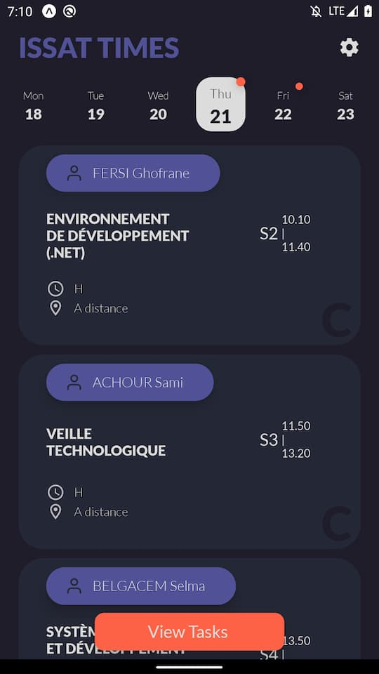
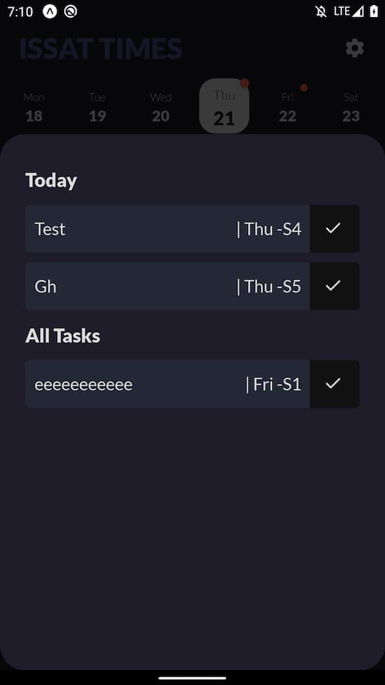
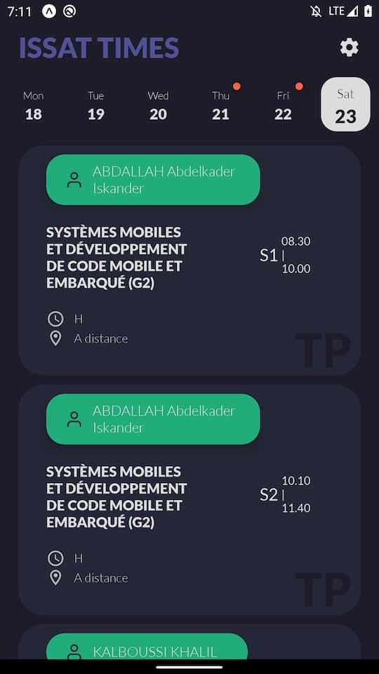
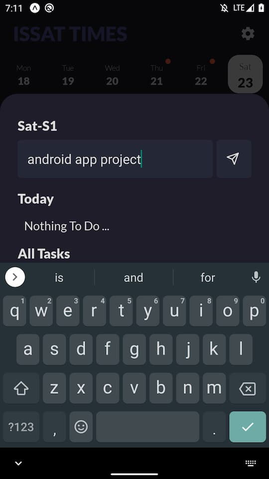
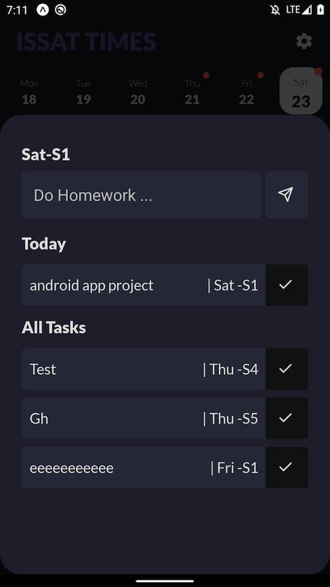
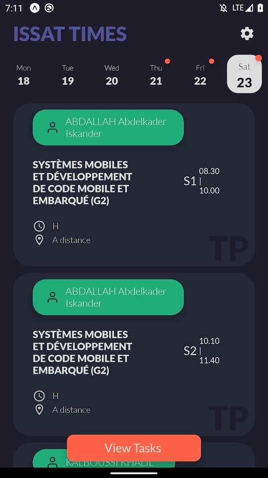
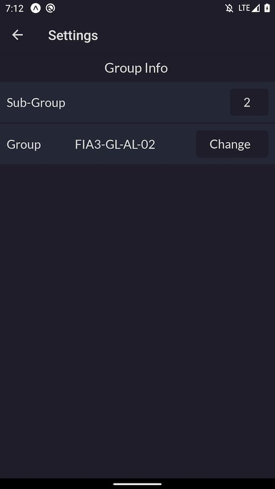

# Issat Times

Planner / Schedule App for Issatso students. developed with react native

## Choosing Group (major)

## Scraping Data from the website

## Main UI - Schedule

## Viewing Tasks

## Adding A Task flow

1. navigating to day
2. taping a subject (seance) to add task
3. entering the task in the modal

## Settings Screen

here the user can change his group (major) and his sub-group (1/2)

